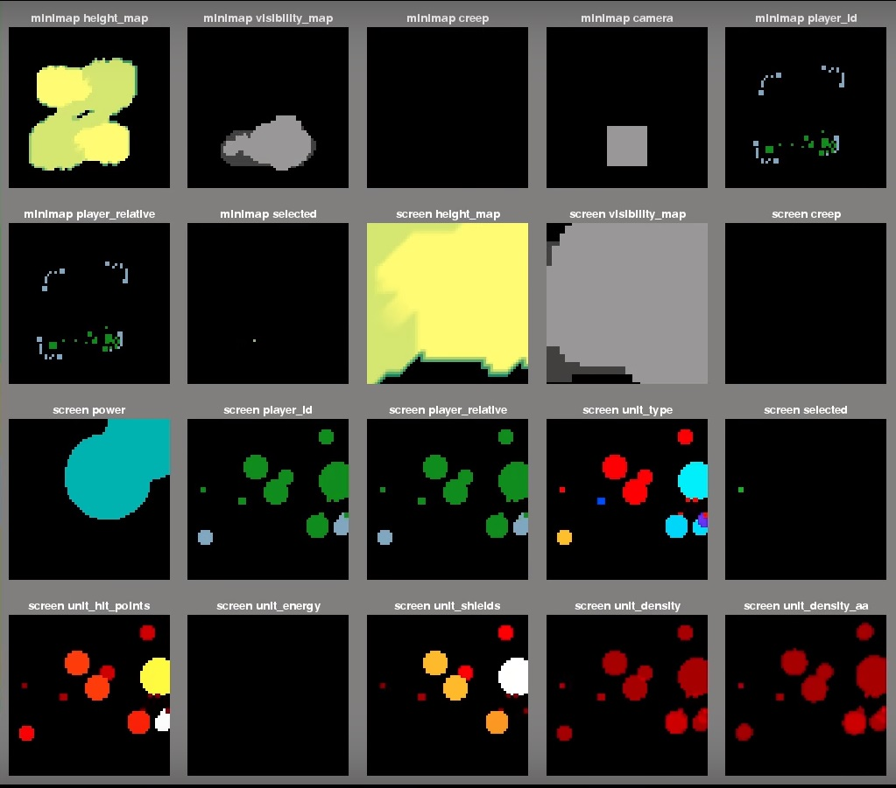
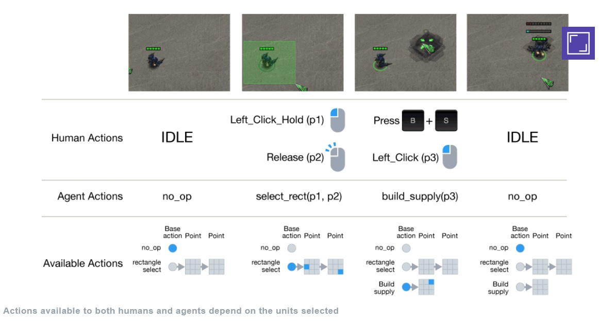
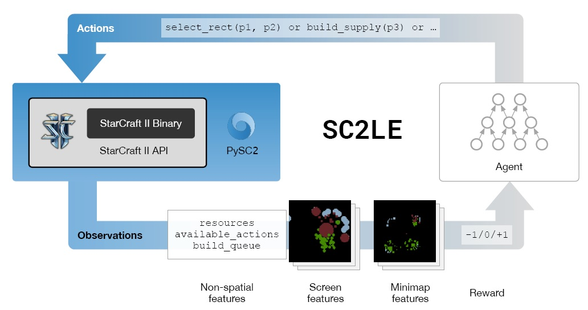

[back](../sc2ai){: .btn.btn-default}

# Benchmarking Deep Reinforcement Learning for Continuous Control

[Paper link](https://arxiv.org/pdf/1604.06778){: target="_blank"}

This paper is about benchmarking of deep reinforcement learning algorithms. This paper has meaning in my project. First of all, I should know how to benchmark the learning algorithm. In this paper, the researchers introduce exisiting algorithms and how to evaluate them. Since I just start the first step of this project, I shold know previous successful researches and the characteristics of them for my interest.

The meaning of reinforcement learning is that "address how agents should learn to take actions to maximize cumulative reward through interactions with the environment". These days, deep learning and reinforcement learning are combined, and show great results. Further, the continuous control makes complexity high. In my project, the target game is SC2(StarCraft 2). If I can get some commonalities between my situation and the situation this paper assume, it would be helpful. 

For reinforcement learning, the policy is really important. The equation of the policy is defined by MDP(Markov Deicision Process):

\\(\pi : policy \qquad\\)
\\(S : states \qquad\\)
\\(A : actions \qquad\\)
\\(\rho : pdf \qquad\\)
\\(r : reward fuctions \qquad\\)
\\(R : reward values \qquad\\)

\\( P = S \times A \times S \to R : the\ transition\ probability\ distribution\\)

this means the transition from one state to the other state by action. Therefore, this is transition probability by an action.

\\(r = S \times A \to R \\)
\\(\pi = S \times A \to R_{\geq,0} \\)

After defining the policy, the continuous feature should be considered. 

\\(\gamma : the\ discount\ factor \\)
\\( \eta\left(\pi \right) = E_r\left[\sum_t^T=0\gamma^tr/left(s_t, a_t\right) \right]\\)

SC2 is quite challengeable because of its characteristics :
- Imperfect information 
- A large action space
- A large state space
- Delayed credit assignment 

As other paper mentioned, Fog-of-War makes the player have imperfect information about the game. It means that the requirements of inference are more complex than other games such as Go, Chess, and Atari. Moreover, SC2 has the large action space and the state space. Considering that SC2 is a RTS(Real-Time Strategy) game, it has a tremendous number of cases at each moment. I think the real problem is that delayed credit assignment is not deterministic. When a player makes some decisions, the decisions get together with the other player's decisions. However, what the player has is imperfect information, So it is really hard to determine that the decisions are right without other player's information. 

To tackle this problem, DeepMind provides guidelines for applying deep reinforcement learning. For the guidelines, the concepts of observation, action, and reward specification are described. 
- Observations
	- 
	Observations are from SC2 API. SC2 API provides feature layers. the feature layers represent unit type, hit points, and etc. These features are figured from minimap and screen. The minimap is more abstracted than the screen, and the screen has more detailed information. These are spatial observations. There are also non-spatial observations such as minerals, gas, and the set of available actions. 
- Actions
	- 
	Actions are following the human interface. each action is represented by the function identifier and the sequence of arguments. As an example, select_rect(select_add, (x1, y1), (x2, y2))
- Reward specifications 
	- DeepMind defines two reward structures. the first structure is ternary 1/0/-1(win/tie/loss), and the other is the provided game score by Blizzard.

the architecture of SC2LE is that PySC2(wrappers of SC2 API) are connected to learning agents. Agents make actions, and the actions make the results. the results are observations. Based on the observations, the agents are rewarded. For the agents, this paper also intruduces baseline agents of reinforcement learning. Although there are many algorithms for this, the main goal of the algorithms is maximization of the rewards. DeepMind apply exsisting models to mini-games and full game.
The result of mini-games is quite nice, but it is not same in the full game. I think that there are some reasons why the models don't work well at the full game.

1. The reward specifications
1. The policy for the scout
1. The policy for strategy

I think these can be problems, and I should check what I think is correct or not. DeepMind mention that if they can solve mini-games, they also solve the full games in the future. However, I think that the mini-games are different from the full game in the characteristics. For full game, the most important thing is not tasks or tactics, but strategies. In this project, I'll focus on the strategies for applying algorithms.